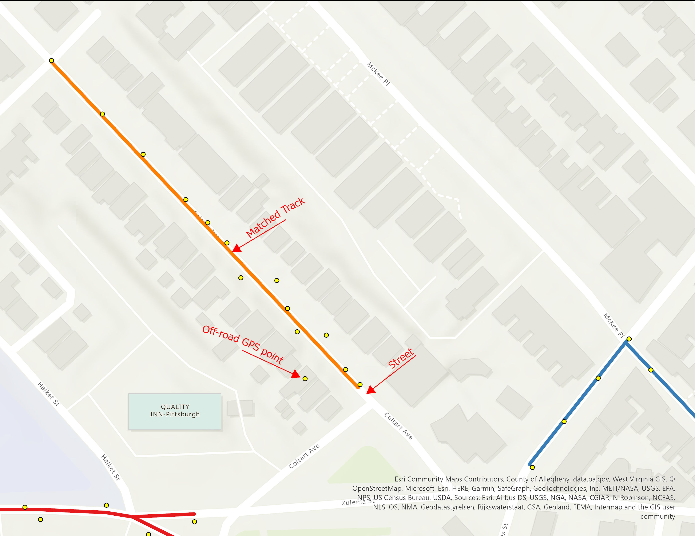
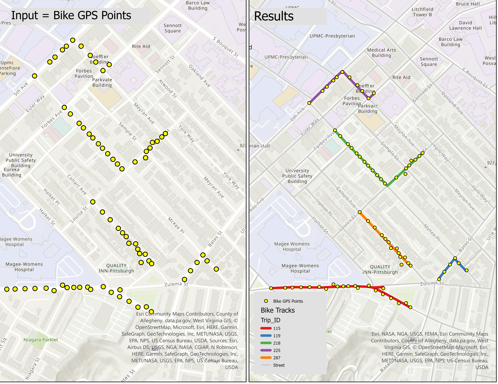

# MapMatching
Matching GPS points to a network or finding routes connecting stops.

## Introduction 
Map matching is a process that takes raw GPS data, which includes latitude and longitude coordinates taken at a certain interval, and 'matches' this data onto a digital road network or map. This process is essential for improving the accuracy of GPS data, especially in urban settings where signals may be lost due to tall buildings or other structures, also known as the "urban canyon" effect.
In the context of vehicle GPS tracking, for example, raw GPS data can place a vehicle in the middle of a block, in a building, or off the road due to various forms of error. Map matching algorithms correct this by 'snapping' the raw GPS points to the most likely road in the network, based on the direction of travel, the layout of the road network, and other factors.
This repository includes three Jupyter Notebooks designed to align five groups of bike GPS points with the Pittsburgh street network. While we've provided sample data, you can modify the code to apply it to your own substantial data sets. Map matching is carried out via ArcGIS routing—a specific network analysis tool—and ArcPy, a Python site package. Please note that these Python scripts can also be utilized to identify routes connecting diverse groups of stops, such as determining various bus routes based on their stop locations within the street nestwork.

## Case Study and Data Explanation
In this repository, we demonstrate the map-matching of GPS points from five cyclists onto the Pittsburgh street network. The image provided showcases a matched track for one cyclist, the corresponding GPS points, and an off-road GPS point that is situated far from the street (the cyclist's track), which is attributed to GPS error.



Our Python scripts are designed to accept a GPS point shapefile (depicted on the left side of the image) and the street network as inputs. The output will be five matched tracks (shown on the right side of the image). Sample bike GPS points feature class (Bike_GP_Point.shp) and the Pittsburgh street network (PittsburghStreets_ND) can be found in the Data folder of the repository.



The Bike_GP_Point attribute table provides information for each bike GPS point. The Trip_ID field serves as a unique identifier for each set of GPS points, representing individual bike tracks. The START_AT field shows the timestamp of each recorded GPS point. By sorting the GPS points in ascending order based on START_AT, we can ascertain the direction of each bike trip. PittsburghStreets_ND is a network dataset, based on TIGER, which is available in the data folder.## Python Scripts
The three Jupyter Notebook Python scripts are strikingly similar, each designed to map the optimal track to each set of GPS points. Each of these Jupyter Notebooks is divided into two sections. The first part, consistent across all three, assists in importing necessary libraries like ArcGIS and ArcPy. This enables connection of the scripts to your ArcGIS Pro/Online account and utilization of requisite functions for spatial analysis.
ArcPy is a Python site package that offers an efficient method for geographic data analysis, data conversion, data management, and map automation with Python. Please note that ArcGIS Pro must already be installed and an ArcGIS account must be active to use ArcPy, as it is included in the installation of ArcGIS and ArcGIS Pro. Ensure that you have a compatible version of Python installed for your ArcGIS version. The Python installation accompanying ArcGIS is usually found in the "C:\Program Files\ArcGIS\Pro\bin\Python\envs\arcgispro-py[python version number]", which is the ArcGIS installation directory.
The second part of each script differs slightly. Below, I briefly explain these variations for the second part of the Python scripts in each Jupyter Notebook.

### MM1.ipynb
The first file, "MM1.ipynb", utilizes PittsburghStreets_ND as the routing network, a free TIGER-based system. Utilizing a TIGER-based network allows you to map routes connecting GPS points on the Pittsburgh street network, but it doesn't allow for travel mode selection, such as accounting for travel times for various transportation modes like biking. Furthermore, a freely downloaded network might not be up-to-date or account for smaller valleys, minor streets, or precise speed limits. To achieve a more accurate transportation network, you can use the ArcGIS online server network, but be aware that this involves credit charges. The use of the ArcGIS online server network is outlined in the other two Jupyter Notebooks.
In this script, I employed arcpy.na.MakeRouteLayer to start the route layer creation process. To devise a path that's compatible with bike travel mode, the "UTurn_policy" is set to "ALLOW_UTURNS" within the arcpy.na.MakeRouteLayer function. This setup is visible in the following code block.
```python 
network_dataset = r"C:\Users\Data\PittsburghStreets\PittsburghStreets_ND"
Org_stops_layer = "Bike_GP_Point"
impedance_attribute = "Minutes"
UTurn_policy        = "ALLOW_UTURNS"
route_layer_name = f"Route_{ids}"
arcpy.na.MakeRouteLayer(network_dataset, route_layer_name, impedance_attribute, UTurn_policy)
```
### MM2-Walking-Distance.ipynb
When using the ArcGIS online server network and the arcpy.na.MakeRouteAnalysisLayer function to start the route creation process, you gain the ability to consider travel mode. As a result, the output file can contain travel time and a matched track that aligns with the travel mode's characteristics, such as speed limit and accessible routes. By default, the arcpy.na.MakeRouteAnalysisLayer and ArcGIS server offer eight travel modes, including Driving Time/Distance, Trucking Time/Distance, and Walking Time/Distance. However, a Biking travel mode is not readily available as a default standard.
Don't fret, though. Fortunately, you can establish a new travel mode using the arcpy.na.TravelMode function, which is detailed in the subsequent Jupyter Notebook file, MM3-BikeMode.ipynb. This Python script involves setting the street network, the walking distance travel mode, and determining the corresponding track for each unique trip id set of points.
In the final polyline attribute table, you'll be able to calculate the track length and walking travel time for each cyclist, each marked by a unique trip id. The script is valuable for measuring the length of each track when travel time is not estimated based on the bike travel mode. The routing, grounded on the walking distance travel mode, is suitable for matching GPS points, as the routing algorithm considers U-turn allowances and street/trail selection, closely mirroring the biking travel mode. Here's the function to generate a route layer.
```python 
# Create a Route layer
network_dataset = "https://www.arcgis.com/" 
travel_mode     = "Walking Distance"
route_layer_name = f"Route_{ids}"
arcpy.na.MakeRouteAnalysisLayer(network_dataset, route_layer_name, travel_mode)
```
### MM3-BikeMode
This script involves specifying the street network, creating a new bicycle travel mode by increasing the average speed from the walking travel mode's 5 km/h to 15 km/h, and pinpointing the corresponding track for each unique set of trip id points. In the final polyline attribute table, you'll be able to ascertain the biking travel time and track length for each cyclist, each identified by a unique trip id. Here is a part of the script:
```python 
# Set up the input parameters
network_dataset = https://www.arcgis.com/
Org_stops_layer = "Bike_GP_Point"
# Get all travel modes from the network dataset
travel_modes = arcpy.na.GetTravelModes(network_dataset)
# Construct a new TravelMode object from the existing Walking Time travel mode
new_travel_mode = arcpy.na.TravelMode(travel_modes["Walking Time"])
# Update the speed limit property to biking speed limit, and update the name
attr_params = new_travel_mode.attributeParameters
attr_params[('WalkTime', 'Walking Speed (km/h)')] = 15
new_travel_mode.attributeParameters = attr_params 
# Create a Route layer:
arcpy.na.MakeRouteAnalysisLayer(network_dataset, route_layer_name, new_travel_mode)
```
